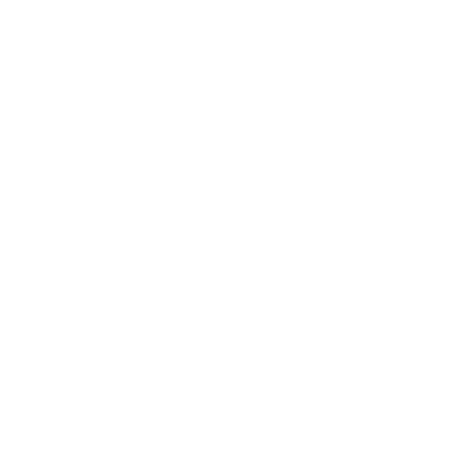

```{=html}
<div class="search-bar-section">
  <div class="search-bar-inner">
    <svg xmlns="http://www.w3.org/2000/svg" width="16" height="16" fill="currentColor"
         viewBox="0 0 16 16" class="search-icon" aria-hidden="true">
      <path d="M11.742 10.344a6.5 6.5 0 1 0-1.397 1.398h-.001c.03.04.062.078.098.115l3.85 3.85a1 1 0 0 0 1.415-1.414l-3.85-3.85a1.007 1.007 0 0 0-.115-.099zm-5.242 1.656a5.5 5.5 0 1 1 0-11 5.5 5.5 0 0 1 0 11z"/>
    </svg>
    <input
      type="text"
      class="search-bar-input"
      placeholder="Search projects, analysis, blog posts..."
      aria-label="Search site"
      onclick="
        var btn = document.querySelector('.aa-DetachedSearchButton, #quarto-search button, [data-bs-toggle=search]');
        if (btn) { btn.click(); } else {
          var e = new KeyboardEvent('keydown', {key: 'k', ctrlKey: true, bubbles: true});
          document.dispatchEvent(e);
        }
      "
      readonly
    />
  </div>
</div>
```

```{=html}
<section class="hero-section">
  <div class="content-block">
    <div class="hero-label">Economics · Policy · Data</div>
    <h1 class="hero-title">Farhan Aditya<br>Ramadhan</h1>
    <p class="hero-sub">Economics graduate from Universitas Indonesia specializing in macroeconomics and historical economics, using causal inference and applied econometrics, with Stata, R, and Python.</p>
    <div class="hero-tags">
      <span class="tag">Historical Economics</span>
      <span class="tag">Applied Econometrics</span>
      <span class="tag">Macroeconomics</span>
      <span class="tag">Political Economy</span>
      <span class="tag">Development Economics</span>
      <span class="tag">Public Finance</span>
    </div>
    <div class="hero-cta">
      <a href="about.qmd" class="btn-primary">About Me</a>
      <a href="files/CV/Farhan-Aditya-Ramadhan_CV.pdf" class="btn-secondary" target="_blank">View CV →</a>
    </div>
  </div>
</section>
```

```{=html}
<div class="tools-strip">
  <div class="tools-strip-inner">
    <span class="tools-strip-item">Stata</span>
    <span class="tools-strip-item">R</span>
    <span class="tools-strip-item">Python</span>
    <span class="tools-strip-item">EViews</span>
    <span class="tools-strip-item">LaTeX</span>
    <span class="tools-strip-item">SQL</span>
    <span class="tools-strip-item">Quarto</span>
  </div>
</div>
```

```{r}
#| echo: false
#| results: asis
library(glue)

grad_hero <- "linear-gradient(to top, rgba(0,20,50,0.97) 0%, rgba(0,20,50,0.55) 35%, rgba(0,20,50,0.02) 100%)"
grad_card <- "linear-gradient(to top, rgba(0,20,50,0.88) 0%, rgba(0,20,50,0.82) 35%, rgba(0,20,50,0.62) 100%)"

hero_bg  <- glue("{grad_hero}, url('{params$featured_1_image}')")
card2_bg <- glue("{grad_card}, url('{params$featured_2_image}')")
card3_bg <- glue("{grad_card}, url('{params$featured_3_image}')")
card4_bg <- glue("{grad_card}, url('{params$featured_4_image}')")

html_out <- glue('
<section class="featured-section">
  <div class="featured-header">
    <span class="featured-header-label">Highlights</span>
  </div>
  <a class="featured-hero" href="{params$featured_1_href}"
     style="background-image: {hero_bg};">
    <div class="featured-hero-content">
      <span class="featured-card-tag">{params$featured_1_tag}</span>
      <div class="featured-hero-title">{params$featured_1_title}</div>
      <div class="featured-hero-desc">{params$featured_1_desc}</div>
      <span class="featured-read-more">Read more &#8594;</span>
    </div>
  </a>
  <div class="featured-row">
    <a class="featured-card" href="{params$featured_2_href}"
       style="background-image: {card2_bg};">
      <div class="featured-card-content">
        <span class="featured-card-tag">{params$featured_2_tag}</span>
        <div class="featured-card-title">{params$featured_2_title}</div>
        <span class="featured-read-more">Read more &#8594;</span>
      </div>
    </a>
    <a class="featured-card" href="{params$featured_3_href}"
       style="background-image: {card3_bg};">
      <div class="featured-card-content">
        <span class="featured-card-tag">{params$featured_3_tag}</span>
        <div class="featured-card-title">{params$featured_3_title}</div>
        <span class="featured-read-more">Read more &#8594;</span>
      </div>
    </a>
    <a class="featured-card" href="{params$featured_4_href}"
       style="background-image: {card4_bg};">
      <div class="featured-card-content">
        <span class="featured-card-tag">{params$featured_4_tag}</span>
        <div class="featured-card-title">{params$featured_4_title}</div>
        <span class="featured-read-more">Read more &#8594;</span>
      </div>
    </a>
  </div>
</section>')

knitr::asis_output(html_out)
```

```{=html}
<div class="mywork-section">
  <div class="mywork-header">
    <span class="mywork-header-title">Contents</span>
  </div>
  <div class="mywork-strip" id="mywork-strip">

    <!-- 0: Analysis -->
    <div class="mywork-panel active" data-index="0"
         style="--panel-bg: url('images/workpanels/pexels-n-voitkevich-6120214.webp') center/cover no-repeat;">
      <div class="mywork-panel-bg"></div>
      <div class="mywork-panel-content">
        <div class="mywork-panel-tag">Projects</div>
        <div class="mywork-panel-title">Analysis</div>
        <div class="mywork-panel-desc">Empirical data analysis, econometric modelling, and policy evaluation.</div>
        <a class="mywork-panel-link" href="webpages/projects/analysis.qmd">Explore &rarr;</a>
      </div>
      <button class="mywork-panel-collapsed-label" aria-label="Analysis">
        <span>Analysis</span>
      </button>
    </div>

    <!-- 1: Research -->
    <div class="mywork-panel" data-index="1"
         style="--panel-bg: url('images/workpanels/inaki-del-olmo-NIJuEQw0RKg-unsplash.webp') center/cover no-repeat;">
      <div class="mywork-panel-bg"></div>
      <div class="mywork-panel-content">
        <div class="mywork-panel-tag">Projects</div>
        <div class="mywork-panel-title">Research</div>
        <div class="mywork-panel-desc">Academic-style writings and working papers.</div>
        <a class="mywork-panel-link" href="webpages/projects/research.qmd">Explore &rarr;</a>
      </div>
      <button class="mywork-panel-collapsed-label" aria-label="Research">
        <span>Research</span>
      </button>
    </div>

    <!-- 2: Blog -->
    <div class="mywork-panel" data-index="2"
         style="--panel-bg: url('images/workpanels/pexels-pixabay-159497.webp') center/cover no-repeat;">
      <div class="mywork-panel-bg"></div>
      <div class="mywork-panel-content">
        <div class="mywork-panel-tag">Projects</div>
        <div class="mywork-panel-title">Blog</div>
        <div class="mywork-panel-desc">Short-form writing on economics, methodology, data, and ideas.</div>
        <a class="mywork-panel-link" href="webpages/projects/blog.qmd">Explore &rarr;</a>
      </div>
      <button class="mywork-panel-collapsed-label" aria-label="Blog">
        <span>Blog</span>
      </button>
    </div>

    <!-- 3: Playground -->
    <div class="mywork-panel" data-index="3"
         style="--panel-bg: url('images/workpanels/chris-ried-ieic5Tq8YMk-unsplash.webp') center/cover no-repeat;">
      <div class="mywork-panel-bg"></div>
      <div class="mywork-panel-content">
        <div class="mywork-panel-tag">Projects</div>
        <div class="mywork-panel-title">Playground</div>
        <div class="mywork-panel-desc">Code, experiments, and things I'm trying out with outputs and syntax included.</div>
        <a class="mywork-panel-link" href="webpages/projects/playground.qmd">Explore &rarr;</a>
      </div>
      <button class="mywork-panel-collapsed-label" aria-label="Playground">
        <span>Playground</span>
      </button>
    </div>

    <!-- divider -->
    <div class="mywork-divider"></div>

    <!-- 4: R / RStudio -->
    <div class="mywork-panel" data-index="4"
         style="--panel-bg: url('images/workpanels/deng-xiang--WXQm_NTK0U-unsplash.webp') center/cover no-repeat;">
      <div class="mywork-panel-bg"></div>
      <div class="mywork-panel-content">
        <div class="mywork-panel-tag">Resources</div>
        <div class="mywork-panel-title">R &amp; RStudio</div>
        <div class="mywork-panel-desc">Books, tutorials, and notes on R, ggplot2, tidyverse, and Quarto.</div>
        <a class="mywork-panel-link" href="webpages/resources/rstudio.qmd">Explore &rarr;</a>
      </div>
      <button class="mywork-panel-collapsed-label" aria-label="R and RStudio">
        <span>R / RStudio</span>
      </button>
    </div>

    <!-- 5: Stata -->
    <div class="mywork-panel" data-index="5"
         style="--panel-bg: url('images/workpanels/markus-winkler-IrRbSND5EUc-unsplash.webp') center/cover no-repeat;">
      <div class="mywork-panel-bg"></div>
      <div class="mywork-panel-content">
        <div class="mywork-panel-tag">Resources</div>
        <div class="mywork-panel-title">Stata</div>
        <div class="mywork-panel-desc">Books, tutorials, and notes on Stata for data management and econometric estimation.</div>
        <a class="mywork-panel-link" href="webpages/resources/stata.qmd">Explore &rarr;</a>
      </div>
      <button class="mywork-panel-collapsed-label" aria-label="Stata">
        <span>Stata</span>
      </button>
    </div>

    <!-- 6: Python -->
    <div class="mywork-panel" data-index="6"
         style="--panel-bg: url('images/workpanels/pexels-nemuel-6424590.webp') center/cover no-repeat;">
      <div class="mywork-panel-bg"></div>
      <div class="mywork-panel-content">
        <div class="mywork-panel-tag">Resources</div>
        <div class="mywork-panel-title">Python</div>
        <div class="mywork-panel-desc">Books, tutorials, and notes on Python.</div>
        <a class="mywork-panel-link" href="webpages/resources/python.qmd">Explore &rarr;</a>
      </div>
      <button class="mywork-panel-collapsed-label" aria-label="Python">
        <span>Python</span>
      </button>
    </div>

    <!-- 7: Macroeconomics -->
    <div class="mywork-panel" data-index="7"
         style="--panel-bg: url('images/workpanels/pexels-tomfisk-4884639.webp') center/cover no-repeat;">
      <div class="mywork-panel-bg"></div>
      <div class="mywork-panel-content">
        <div class="mywork-panel-tag">Resources</div>
        <div class="mywork-panel-title">Macroeconomics</div>
        <div class="mywork-panel-desc">Books, tutorials, and notes on macroeconomics.</div>
        <a class="mywork-panel-link" href="webpages/resources/macro.qmd">Explore &rarr;</a>
      </div>
      <button class="mywork-panel-collapsed-label" aria-label="Macroeconomics">
        <span>Macro</span>
      </button>
    </div>

    <!-- 8: Econometrics -->
    <div class="mywork-panel" data-index="8"
         style="--panel-bg: url('images/workpanels/pexels-leeloothefirst-7873554.webp') center/cover no-repeat;">
      <div class="mywork-panel-bg"></div>
      <div class="mywork-panel-content">
        <div class="mywork-panel-tag">Resources</div>
        <div class="mywork-panel-title">Econometrics</div>
        <div class="mywork-panel-desc">Books, tutorials, and notes on applied econometrics and estimation methods.</div>
        <a class="mywork-panel-link" href="webpages/resources/econometrics.qmd">Explore &rarr;</a>
      </div>
      <button class="mywork-panel-collapsed-label" aria-label="Econometrics">
        <span>Econometrics</span>
      </button>
    </div>

    <!-- 9: Causal Inference -->
    <div class="mywork-panel" data-index="9"
         style="--panel-bg: url('images/workpanels/hanna-morris-_XXNjSziZuA-unsplash.webp') center/cover no-repeat;">
      <div class="mywork-panel-bg"></div>
      <div class="mywork-panel-content">
        <div class="mywork-panel-tag">Resources</div>
        <div class="mywork-panel-title">Causal Inference</div>
        <div class="mywork-panel-desc">Books, tutorials, and notes on causal inference and impact evaluation.</div>
        <a class="mywork-panel-link" href="webpages/resources/causalinference.qmd">Explore &rarr;</a>
      </div>
      <button class="mywork-panel-collapsed-label" aria-label="Causal Inference">
        <span>Causal Inference</span>
      </button>
    </div>

    <!-- divider -->
    <div class="mywork-divider"></div>

    <!-- 10: Graphics -->
    <div class="mywork-panel" data-index="10"
         style="--panel-bg: url('images/workpanels/luke-chesser-JKUTrJ4vK00-unsplash-_1_.webp') center/cover no-repeat;">
      <div class="mywork-panel-bg"></div>
      <div class="mywork-panel-content">
        <div class="mywork-panel-tag">Projects</div>
        <div class="mywork-panel-title">Graphics</div>
        <div class="mywork-panel-desc">Interactive charts, maps, and exploratory dashboards built with R.</div>
        <a class="mywork-panel-link" href="webpages/graphics/graphics.qmd">Explore &rarr;</a>
      </div>
      <button class="mywork-panel-collapsed-label" aria-label="Graphics">
        <span>Graphics</span>
      </button>
    </div>

  </div>
</div>
```

```{=html}
<!--
  GRAPHICS FOR EXPLORATION — two-column layout
  Left  : dark navy panel (full height)
  Right : vertically scrolling white cards
  Cards auto-populated from webpages/graphics/graphics/*.qmd
  via the hidden #gc-listing-source Quarto listing below.

  Scraper note: initGraphicSection() expects Quarto default
  listing HTML. If cards break, check for changes to:
    .list-group-item > .listing-title
    .list-group-item > .listing-description
    .listing-category
-->
<div class="gc-section">

  <!-- Hidden Quarto listing; JS reads and converts to custom cards -->
  <div id="gc-listing-source" style="display:none;">
```

::: {#graphics}
:::

```{=html}
  </div>

  <div class="gc-section-header">
    <span class="gc-section-title">Graphics</span>
    <div class="gc-arrows">
      <button class="gc-arrow" id="gc-prev" aria-label="Scroll up">&#8593;</button>
      <button class="gc-arrow" id="gc-next" aria-label="Scroll down">&#8595;</button>
    </div>
  </div>

  <div class="gc-layout">
    <div class="gc-left">
      <span class="gc-left-kicker">Interactive · Exploratory</span>
      <h2 class="gc-left-title">Graphics<br>for<br>Exploration</h2>
      <p class="gc-left-desc">
        Interactive charts, maps, and exploratory dashboards
        built with R — Shiny, plotly, highcharter, and more.
      </p>
      <a class="gc-left-link" href="webpages/graphics/graphics.qmd">View all →</a>
      <div class="gc-left-deco" aria-hidden="true">
        <svg viewBox="0 0 260 180" fill="none" xmlns="http://www.w3.org/2000/svg">
          <polyline points="20,160 80,110 130,130 190,60 240,80"
            stroke="rgba(255,255,255,0.13)" stroke-width="2" fill="none"/>
          <circle cx="80"  cy="110" r="5" fill="none" stroke="rgba(255,255,255,0.18)" stroke-width="1.5"/>
          <circle cx="130" cy="130" r="5" fill="none" stroke="rgba(255,255,255,0.18)" stroke-width="1.5"/>
          <circle cx="190" cy="60"  r="5" fill="none" stroke="rgba(255,255,255,0.18)" stroke-width="1.5"/>
        </svg>
      </div>
    </div>

    <div class="gc-right">
      <div class="gc-viewport" id="gc-viewport">
        <div class="gc-track" id="gc-track">
          <!-- cards injected by initGraphicSection() -->
        </div>
      </div>
    </div>
  </div>
</div>
```

```{=html}
<!-- ============================================================
     UNIFIED PROJECTS SECTION
     Header matches Graphics/Contents style (serif title, no border).
     Tab bar sits below the title: tabs LEFT, arrows RIGHT —
     arrows are clearly for the card carousel, not for tab switching.
     ============================================================ -->
<div class="pu-section">

  <!-- Section header: same pattern as gc-section-header -->
  <div class="pu-section-header">
    <span class="pu-section-title">Projects</span>
  </div>

  <!-- Tab bar: tabs LEFT · arrows RIGHT
       Arrows sit here so they are spatially tied to the card row,
       not to the tab buttons. -->
  <div class="pu-tab-bar">
    <div class="pu-tabs" id="pu-tabs" role="tablist">
      <button class="pu-tab active" data-tab="analysis"   role="tab" aria-selected="true">Analysis</button>
      <button class="pu-tab"        data-tab="research"   role="tab">Research</button>
      <button class="pu-tab"        data-tab="blog"       role="tab">Blog</button>
      <button class="pu-tab"        data-tab="playground" role="tab">Playground</button>
    </div>
    <div class="pu-arrows">
      <button class="pu-arrow" id="pu-prev" aria-label="Previous">&#8592;</button>
      <button class="pu-arrow" id="pu-next" aria-label="Next">&#8594;</button>
    </div>
  </div>

  <!-- Carousel viewport -->
  <div class="pu-carousel-wrap">
    <div class="pu-carousel-inner" id="pu-viewport"></div>
  </div>

  <!-- Tab-aware "View all" link -->
  <a class="pu-view-all" id="pu-view-all" href="webpages/projects/analysis.qmd">
    View all Analysis →
  </a>

</div>

<!-- Hidden Quarto listing sources — JS reads cards from here -->
<div id="pu-source-analysis"   class="pu-source" style="display:none;">
```

:::{#analysis}
:::

```{=html}
</div>
<div id="pu-source-research"   class="pu-source" style="display:none;">
```

:::{#research}
:::

```{=html}
</div>
<div id="pu-source-blog"       class="pu-source" style="display:none;">
```

:::{#blog}
:::

```{=html}
</div>
<div id="pu-source-playground" class="pu-source" style="display:none;">
```

:::{#playground}
:::

```{=html}
</div>
```

```{=html}
<div class="resources-section">
  <div class="resources-section-inner">
    <div class="resources-header">
      <span class="resources-header-title">Resources</span>
    </div>
    <div class="resources-grid">
      <a class="resource-card" href="webpages/resources/rstudio.qmd">
        <div class="resource-card-icon"><i class="fa-brands fa-r-project"></i></div>
        <div class="resource-card-title">R &amp; RStudio</div>
        <div class="resource-card-desc">Books, tutorials, and notes for learning R, ggplot2, tidyverse, and Quarto.</div>
      </a>
      <a class="resource-card" href="webpages/resources/stata.qmd">
        <div class="resource-card-icon">
          
        </div>
        <div class="resource-card-title">Stata</div>
        <div class="resource-card-desc">Guides and do-file notes for data management, econometric estimation, and microdata analysis.</div>
      </a>
      <a class="resource-card" href="webpages/resources/python.qmd">
        <div class="resource-card-icon"><i class="fa-brands fa-python"></i></div>
        <div class="resource-card-title">Python</div>
        <div class="resource-card-desc">Books, tutorials, and notes on Python.</div>
      </a>
      <a class="resource-card" href="webpages/resources/macro.qmd">
        <div class="resource-card-icon"><i class="bi bi-graph-up-arrow"></i></div>
        <div class="resource-card-title">Macroeconomics</div>
        <div class="resource-card-desc">Notes and resources on macroeconomic theory, time-series modelling, and policy analysis.</div>
      </a>
      <a class="resource-card" href="webpages/resources/econometrics.qmd">
        <div class="resource-card-icon"><i class="bi bi-calculator"></i></div>
        <div class="resource-card-title">Econometrics</div>
        <div class="resource-card-desc">Applied econometrics resources covering OLS, panel data, IV, ARDL, and structural estimation.</div>
      </a>
      <a class="resource-card" href="webpages/resources/causalinference.qmd">
        <div class="resource-card-icon"><i class="bi bi-diagram-3"></i></div>
        <div class="resource-card-title">Causal Inference</div>
        <div class="resource-card-desc">Resources on DiD, RD, IV, matching, and impact evaluation methods.</div>
      </a>
    </div>
  </div>
</div>


<!-- ============================================================
     PAGE JAVASCRIPT
     All index-page behaviour in one block:
       1. mywork accordion
       2. unified projects carousel (initUnifiedProjects)
       3. graphics section (initGraphicSection)
     ============================================================ -->
<script>
(function () {
  'use strict';

  /* ----------------------------------------------------------
     1. MYWORK ACCORDION
     ---------------------------------------------------------- */
  var strip = document.getElementById('mywork-strip');
  if (strip) {
    var panels = Array.from(strip.querySelectorAll('.mywork-panel'));

    function activatePanel(idx) {
      panels.forEach(function (p, i) {
        p.classList.toggle('active', i === idx);
      });
    }

    panels.forEach(function (panel, i) {
      panel.addEventListener('click', function () {
        if (!panel.classList.contains('active')) activatePanel(i);
      });

      var btn = panel.querySelector('.mywork-panel-collapsed-label');
      if (btn) {
        btn.addEventListener('click', function (e) {
          e.stopPropagation();
          activatePanel(i);
        });
      }
    });
  }


  /* ----------------------------------------------------------
     2. UNIFIED PROJECTS CAROUSEL
     Reads cards from hidden #pu-source-{tab} divs (Quarto
     renders cards there), clones them into #pu-viewport,
     and sizes them to fill the available width.

     Tab map — href is the "View all" destination per tab.
     ---------------------------------------------------------- */
  var PU_TABS = {
    analysis:   { href: 'webpages/projects/analysis.qmd',   label: 'Analysis'   },
    research:   { href: 'webpages/projects/research.qmd',   label: 'Research'   },
    blog:       { href: 'webpages/projects/blog.qmd',       label: 'Blog'       },
    playground: { href: 'webpages/projects/playground.qmd', label: 'Playground' }
  };

  var puViewport  = document.getElementById('pu-viewport');
  var puViewAll   = document.getElementById('pu-view-all');
  var puPrev      = document.getElementById('pu-prev');
  var puNext      = document.getElementById('pu-next');
  var puActiveTab = 'analysis';
  var puPos       = 0;           /* current card offset */
  var puCardWidth = 240;         /* recalculated on layout */
  var puGap       = 18;
  var puVisible   = 4;

  /* Clone cards from source div into viewport and initialise carousel */
  function puLoadTab(tabId) {
    if (!puViewport) return;

    var source = document.getElementById('pu-source-' + tabId);
    if (!source) return;

    /* Wait until Quarto has injected cards.
       Quarto grid structure: .quarto-listing-container > .list.grid > .g-col-1
       We grab .g-col-1 regardless of nesting depth. */
    var cards = source.querySelectorAll('.g-col-1');
    if (cards.length === 0) return false;   /* not ready yet */

    /* Fade out, swap, fade in */
    puViewport.classList.add('pu-fade-out');

    setTimeout(function () {
      puViewport.innerHTML = '';
      puPos = 0;

      cards.forEach(function (col) {
        var clone = col.cloneNode(true);
        puViewport.appendChild(clone);
      });

      puLayoutCards();
      puViewport.classList.remove('pu-fade-out');
      puViewport.classList.add('pu-fade-in');
      setTimeout(function () { puViewport.classList.remove('pu-fade-in'); }, 250);
    }, 150);

    return true;
  }

  function puLayoutCards() {
    if (!puViewport) return;
    var cols = puViewport.querySelectorAll('.g-col-1');
    if (cols.length === 0) return;

    var wrap = puViewport.parentElement;
    var availWidth = (wrap ? wrap.offsetWidth : puViewport.offsetWidth) || 800;

    /* Target card width ~240px. Fit as many as possible, min 1.
       On very narrow screens force 1 card so it fills the width. */
    var targetCard = 240;
    var numVisible = Math.max(1, Math.floor((availWidth + puGap) / (targetCard + puGap)));
    numVisible = Math.min(numVisible, cols.length);
    if (availWidth < 400) numVisible = 1;

    puCardWidth = Math.floor((availWidth - (numVisible - 1) * puGap) / numVisible);
    puVisible   = numVisible;

    /* ALWAYS enforce height = width × 1.5 via inline style.
       This overrides the CSS fixed heights and keeps the ratio
       exact at every screen size and card count. */
    var cardHeight = Math.round(puCardWidth * 1.5);

    cols.forEach(function (col) {
      col.style.width    = puCardWidth + 'px';
      col.style.minWidth = puCardWidth + 'px';
      col.style.maxWidth = puCardWidth + 'px';
      col.style.height   = cardHeight + 'px';
      col.style.flexShrink = '0';
      var link = col.querySelector('a.quarto-grid-link');
      var card = col.querySelector('.card');
      if (link) link.style.height = cardHeight + 'px';
      if (card) card.style.height = cardHeight + 'px';
    });

    /* #pu-viewport IS the flex row */
    puViewport.style.display       = 'flex';
    puViewport.style.flexWrap      = 'nowrap';
    puViewport.style.flexDirection = 'row';
    puViewport.style.gap           = puGap + 'px';
    puViewport.style.width         = 'max-content';
    puViewport.style.transition    = 'transform 0.4s ease';

    /* Reset position */
    puPos = 0;
    puApplyTransform();
    puUpdateArrows();
  }

  function puApplyTransform() {
    if (!puViewport) return;
    var step = puCardWidth + puGap;
    puViewport.style.transform = 'translateX(-' + (puPos * step) + 'px)';
  }

  function puUpdateArrows() {
    if (!puViewport) return;
    var totalCards = puViewport.querySelectorAll('.g-col-1').length;
    var max = Math.max(0, totalCards - puVisible);
    if (puPrev) puPrev.disabled = (puPos <= 0);
    if (puNext) puNext.disabled = (puPos >= max);
  }

  function puScroll(dir) {
    if (!puViewport) return;
    var totalCards = puViewport.querySelectorAll('.g-col-1').length;
    var max = Math.max(0, totalCards - puVisible);
    puPos = Math.min(max, Math.max(0, puPos + dir));
    puApplyTransform();
    puUpdateArrows();
  }

  /* Tab switching */
  function puActivate(tabId) {
    if (!PU_TABS[tabId]) return;
    puActiveTab = tabId;

    /* Update tab button states */
    var tabBtns = document.querySelectorAll('.pu-tab');
    tabBtns.forEach(function (btn) {
      var active = btn.dataset.tab === tabId;
      btn.classList.toggle('active', active);
      btn.setAttribute('aria-selected', active ? 'true' : 'false');
    });

    /* Update "View all" link */
    if (puViewAll) {
      puViewAll.href        = PU_TABS[tabId].href;
      puViewAll.textContent = 'View all ' + PU_TABS[tabId].label + ' \u2192';
    }

    /* Load cards — if not ready yet, set up a MutationObserver */
    if (!puLoadTab(tabId)) {
      var source = document.getElementById('pu-source-' + tabId);
      if (!source) return;
      var obs = new MutationObserver(function (_, ob) {
        if (puLoadTab(tabId)) ob.disconnect();
      });
      obs.observe(source, { childList: true, subtree: true });
    }
  }

  /* Wire tab buttons */
  var puTabsEl = document.getElementById('pu-tabs');
  if (puTabsEl) {
    puTabsEl.addEventListener('click', function (e) {
      var btn = e.target.closest('.pu-tab');
      if (!btn) return;
      puActivate(btn.dataset.tab);
    });
  }

  /* Wire arrow buttons */
  if (puPrev) puPrev.addEventListener('click', function () { puScroll(-1); });
  if (puNext) puNext.addEventListener('click', function () { puScroll( 1); });


  /* Debounced resize */
  var puResizeTimer;
  window.addEventListener('resize', function () {
    clearTimeout(puResizeTimer);
    puResizeTimer = setTimeout(function () {
      puLayoutCards();
    }, 150);
  });

  function initUnifiedProjects() {
    /* Load first tab; fallback via MutationObserver is inside puActivate */
    puActivate('analysis');
  }


  /* ----------------------------------------------------------
     3. GRAPHICS FOR EXPLORATION
     Scrapes Quarto default listing from #gc-listing-source
     and renders custom cards into #gc-track.

     Expected Quarto listing HTML structure:
       .list-group-item
         .listing-title   (or h3/h4/.title)
         .listing-description (or .description / p)
         .listing-category (zero or more)
       a[href]            (ancestor or child)
     If cards stop rendering, check Quarto listing output first.
     ---------------------------------------------------------- */
  function initGraphicSection() {
    var source   = document.getElementById('gc-listing-source');
    var track    = document.getElementById('gc-track');
    var viewport = document.getElementById('gc-viewport');
    var btnPrev  = document.getElementById('gc-prev');
    var btnNext  = document.getElementById('gc-next');
    if (!source || !track || !viewport) return;

    var items = source.querySelectorAll('.list-group-item');
    if (items.length === 0) {
      items = source.querySelectorAll('[data-listing-date-sort], .listing-item');
    }

    var cards = [];
    items.forEach(function (item) {
      var titleEl = item.querySelector('.listing-title, h3, h4, .title');
      var descEl  = item.querySelector('.listing-description, .description, p');
      var catEls  = item.querySelectorAll('.listing-category, .badge, .category');
      var linkEl  = item.querySelector('a') || item.closest('a');
      var subEl   = item.querySelector('.listing-subtitle, .subtitle');

      var title    = titleEl ? titleEl.textContent.trim() : '(Untitled)';
      var desc     = descEl  ? descEl.textContent.trim()  : '';
      var href     = linkEl  ? (linkEl.getAttribute('href') || '#') : '#';
      var subtitle = subEl   ? subEl.textContent.trim()   : '';
      var cats     = [];
      catEls.forEach(function (el) {
        var t = el.textContent.trim();
        if (t) cats.push(t);
      });
      cards.push({ title: title, desc: desc, href: href, subtitle: subtitle, cats: cats });
    });

    if (cards.length === 0) {
      cards = [{
        title:    'No graphics yet',
        desc:     'Add .qmd files to webpages/graphics/graphics/ to populate this section.',
        href:     'webpages/graphics/graphics.qmd',
        subtitle: '',
        cats:     ['Interactive']
      }];
    }

    track.innerHTML = '';
    cards.forEach(function (c) {
      var langCat  = c.cats.filter(function (t) { return t.toLowerCase().startsWith('lang:'); });
      var nonLang  = c.cats.filter(function (t) { return !t.toLowerCase().startsWith('lang:'); });
      var kicker   = nonLang.length > 0 ? nonLang[0].toUpperCase() : 'GRAPHIC';
      var toolTags = nonLang.slice(1);
      var langLabel = langCat.length > 0 ? langCat[0].replace(/^lang:/i, '') : '';

      var tagsHtml = '';
      if (toolTags.length > 0 || langLabel) {
        tagsHtml = '<div class="gc-card-tags">';
        if (toolTags.length > 0) {
          tagsHtml += toolTags
            .map(function (t) { return '<span class="gc-card-tag">' + t + '</span>'; })
            .join('<span class="gc-card-tag-sep">·</span>');
        }
        if (langLabel) {
          if (toolTags.length > 0) tagsHtml += '<span class="gc-card-tag-sep">·</span>';
          tagsHtml += '<span class="gc-card-lang">' + langLabel + '</span>';
        }
        tagsHtml += '</div>';
      } else if (c.subtitle) {
        tagsHtml = '<div class="gc-card-tags"><span class="gc-card-tag">' + c.subtitle + '</span></div>';
      }

      var card = document.createElement('a');
      card.className = 'gc-card';
      card.href      = c.href;
      card.innerHTML =
        '<div class="gc-card-inner">' +
          '<div class="gc-card-text">' +
            '<div class="gc-card-kicker">' + kicker + '</div>' +
            '<div class="gc-card-title">' + c.title + '</div>' +
            '<div class="gc-card-desc">' + c.desc + '</div>' +
            tagsHtml +
          '</div>' +
          '<div class="gc-card-btn" aria-hidden="true">&#8599;</div>' +
        '</div>';
      track.appendChild(card);
    });

    var VISIBLE = 4;
    var pos = 0;

    function cardStep() {
      var kids = track.querySelectorAll('.gc-card');
      if (kids.length < 2) return kids.length === 1 ? kids[0].offsetHeight : 160;
      return Math.round(
        kids[1].getBoundingClientRect().top - kids[0].getBoundingClientRect().top
      );
    }

    function setHeight() {
      pos = 0;
      track.style.transform = 'translateY(0)';
      function measure() {
        var kids = track.querySelectorAll('.gc-card');
        if (kids.length === 0) return;
        var n = Math.min(VISIBLE, kids.length);
        var h = Math.round(
          kids[n - 1].getBoundingClientRect().bottom -
          kids[0].getBoundingClientRect().top
        );
        if (h > 0) {
          viewport.style.height    = h + 'px';
          viewport.style.maxHeight = h + 'px';
        }
        updateArrows();
      }
      requestAnimationFrame(measure);
      setTimeout(measure, 200);
      setTimeout(measure, 600);
    }

    function updateArrows() {
      btnPrev.disabled = (pos <= 0);
      btnNext.disabled = (pos >= track.children.length - VISIBLE);
    }

    function slideGraphics(dir) {
      pos = Math.min(Math.max(0, pos + dir), Math.max(0, track.children.length - VISIBLE));
      track.style.transform = 'translateY(-' + (pos * cardStep()) + 'px)';
      updateArrows();
    }

    btnPrev.addEventListener('click', function () { slideGraphics(-1); });
    btnNext.addEventListener('click', function () { slideGraphics(1); });
    window.addEventListener('resize', setHeight);

    setHeight();
  }


  /* ----------------------------------------------------------
     INIT — run after DOM is ready
     ---------------------------------------------------------- */
  if (document.readyState === 'loading') {
    document.addEventListener('DOMContentLoaded', function () {
      initUnifiedProjects();
      initGraphicSection();
    });
  } else {
    initUnifiedProjects();
    initGraphicSection();
  }

  /* Fallback for graphics: Quarto may inject listing content late */
  setTimeout(initGraphicSection, 400);
  setTimeout(initGraphicSection, 1000);

  /* Fallback for projects: retry active tab in case Quarto injected late */
  setTimeout(function () { puLoadTab(puActiveTab) || puActivate(puActiveTab); }, 400);
  setTimeout(function () { puLoadTab(puActiveTab) || puActivate(puActiveTab); }, 1000);


  /* ----------------------------------------------------------
     MOBILE TAP-TO-REVEAL — touch devices only (hover: none)
     CSS class: .pu-card-revealed on .g-col-1  (matches styles.css)

     Behaviour:
       First tap  → adds .pu-card-revealed, shows card content
       Second tap → class already present, browser navigates normally
       Tap outside carousel → clears all revealed cards
       Tab switch → clears all revealed cards
     ---------------------------------------------------------- */
  if (window.matchMedia('(hover: none)').matches) {

    /* First/second tap logic */
    document.addEventListener('click', function (e) {
      var link = e.target.closest('#pu-viewport a.quarto-grid-link');
      if (!link) return;

      var col = link.closest('.g-col-1');
      if (!col) return;

      /* Second tap on already-revealed card — let navigation happen */
      if (col.classList.contains('pu-card-revealed')) return;

      /* First tap — reveal this card, close any others */
      e.preventDefault();
      document.querySelectorAll('#pu-viewport .g-col-1').forEach(function (c) {
        c.classList.remove('pu-card-revealed');
      });
      col.classList.add('pu-card-revealed');
    });

    /* Tap outside carousel — clear all revealed cards */
    document.addEventListener('click', function (e) {
      if (!e.target.closest('#pu-viewport')) {
        document.querySelectorAll('#pu-viewport .g-col-1').forEach(function (c) {
          c.classList.remove('pu-card-revealed');
        });
      }
    });

    /* Tab switch — clear revealed state so new tab starts fresh */
    var _origActivate = puActivate;
    puActivate = function (tabId) {
      document.querySelectorAll('#pu-viewport .g-col-1').forEach(function (c) {
        c.classList.remove('pu-card-revealed');
      });
      _origActivate(tabId);
    };
  }

})();
</script>
```
